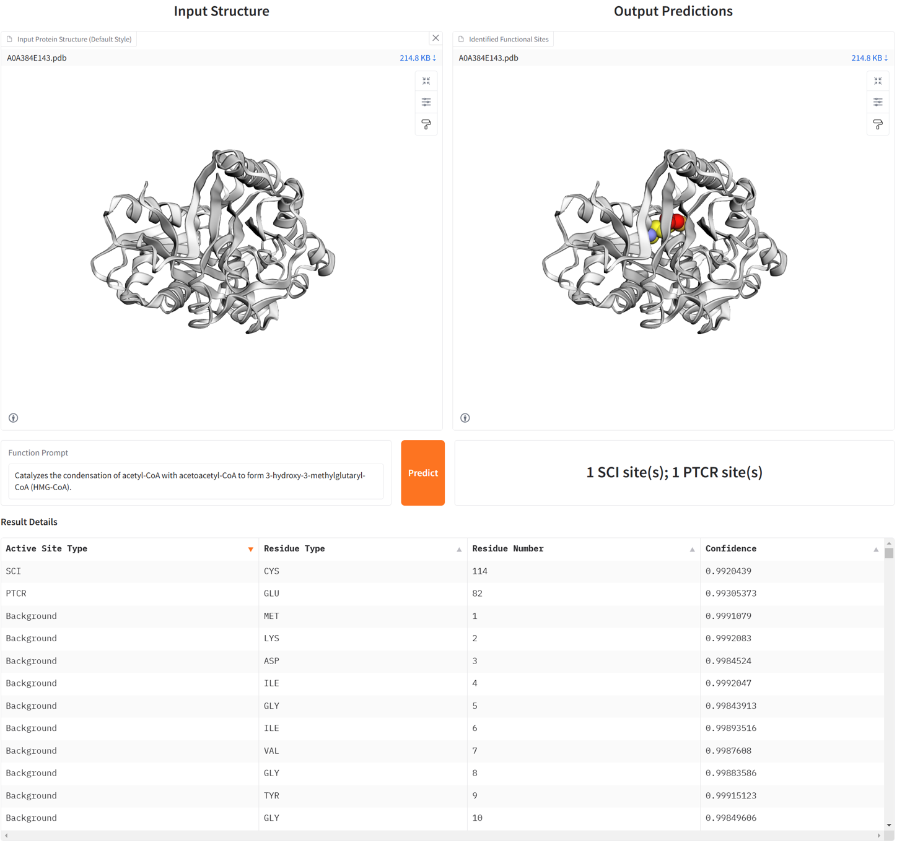
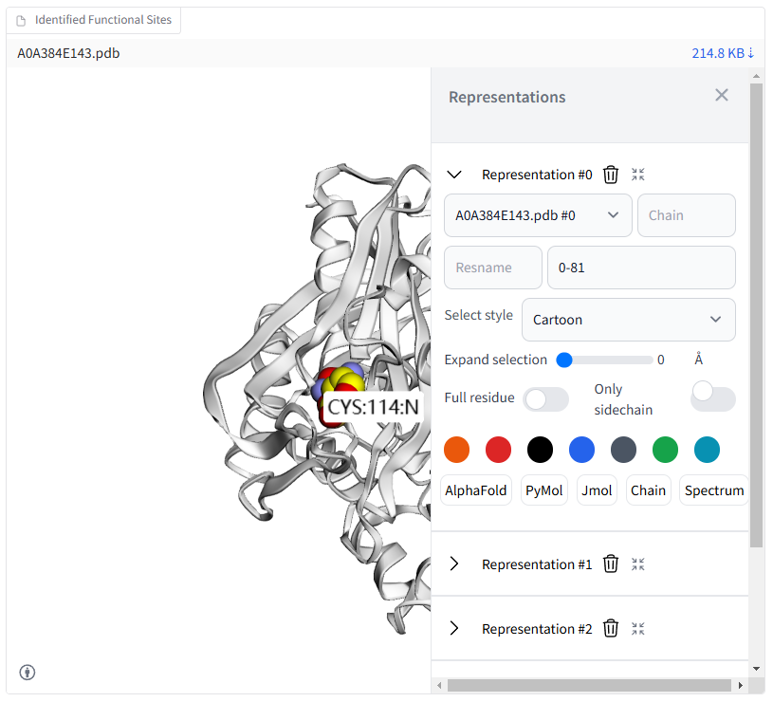

This an interactive demo for the inference. We provide some example `.pdb` files in [`case_study` folder](https://github.com/Gift-OYS/M3Site/tree/main/case_study). You can use these files to use this demo. Take `A0A384E143.pdb` as an example, the predicted protein active site results using M3Site are shown below:

Besides, you can visualize and analyze the predicted results interactively like below:
